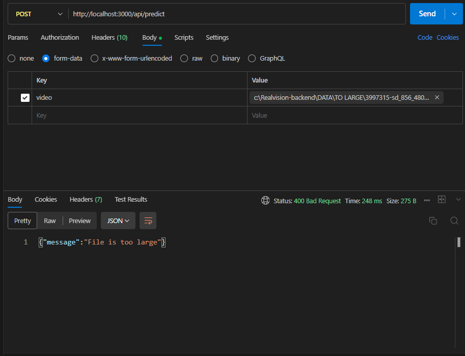

# RealVision Deepfake Detection Backend

Node.js/Express backend for the RealVision project, currently focused on video upload, validation, and API flow design
as preparation for future deepfake model integration.

---

## Current Stack
- Node.js
- Express.js
- Multer

## Current Endpoints
- `GET /` - API health check
- `POST /api/predict` - upload a video file with basic validation and return uploaded file details

## Run Locally
```bash
npm install
node src/server.js
```

---

## Current Functionality
- Express backend setup
- REST API structure
- Video upload endpoint with Multer
- Temporary file storage in `uploads/`
- File type validation (video only)
- File size limit (50MB)

---

## API Validation Examples

The backend currently supports video upload with validation checks for file type and file size.

### Successful upload
A valid video file is accepted and stored temporarily, with upload details returned in the response.


### File size limit validation
Files that exceed the configured size limit are rejected with an error response.



---

## Planned Improvements
- Integration with Python inference pipeline
- Temporary file cleanup after processing
- Return prediction result and confidence score
