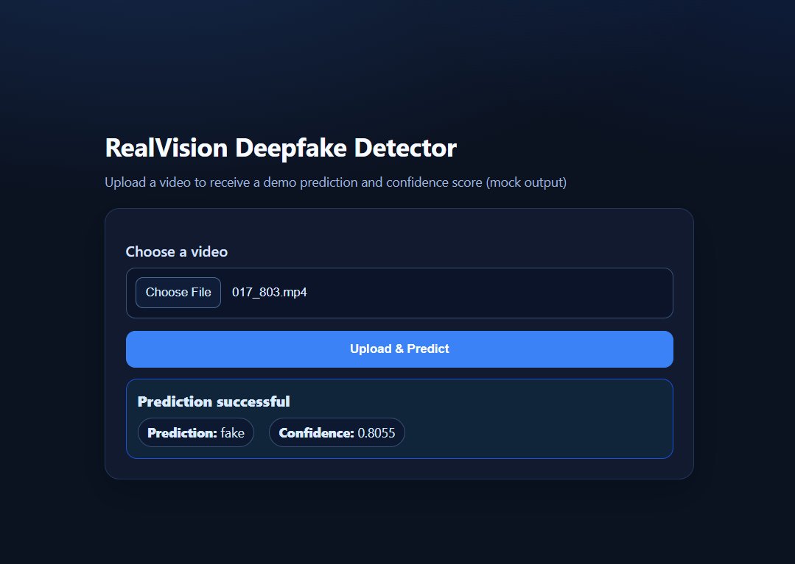

# RealVision Backend API

Live Demo: [View the app here](https://realvision-deepfake-detection-backend.onrender.com)
---
Backend-first project for the RealVision system, designed to support video upload, validation, and a minimal frontend demo for real/fake video prediction using mock inference logic.




---

## Current Stack
- Node.js
- Express.js
- Multer
- Vanilla HTML / CSS / JavaScript

## Current Endpoints
- `GET /` - serves the frontend demo page
- `GET /api/health` - API health check
- `POST /api/predict` - upload a video file, validate it, run mock inference, and return prediction JSON

## Run Locally
```bash
npm install
npm start
```

Same as production-style runs: `npm start` runs `node src/server.js`. Render sets `PORT` automatically; locally it defaults to `3000` via `src/config/index.js`.
## Current Functionality
- Express backend setup

- REST API structure

- Video upload endpoint with Multer

- Temporary file storage in uploads/

- File type validation (video only)

- File size limit (50MB)

- Mock inference integration (no Python required to run this demo)

- Prediction response with:

  - message

  - prediction

  - confidence

- Temporary file cleanup after processing

- Minimal frontend demo for video upload and prediction display

## API Response Example

```
{
  "message": "Prediction successful",
  "prediction": "fake",
  "confidence": 0.87
}
```
Note: This is an example shape only. In demo mode, prediction/confidence values vary per request.

### Validation Examples


The backend currently supports video upload with validation checks for file type and file size.


### Invalid file type


Non-video files are rejected with an error response.

### File size limit validation


Files that exceed the configured size limit are rejected with an error response.

### Successful prediction flow


A valid video file is accepted, processed through the mock inference layer, and returns a prediction response.

## Frontend Demo


The project includes a minimal frontend demo that allows a user to:

- choose a video file

- upload it to the backend

- receive prediction results

- view confidence score

- view validation / inference errors

## Project Status

This project currently uses a backend mock inference layer for demo purposes.
The backend and demo frontend are working end-to-end, and the next major step is integrating the real trained model (for example via Python/ML inference).

## Planned Improvements
- Replace mock inference with real model integration
- Improve frontend UI/UX further
- Consider optional persistence/history only if needed

## Author

GitHub:[Menaluc](https://github.com/Menaluc)
